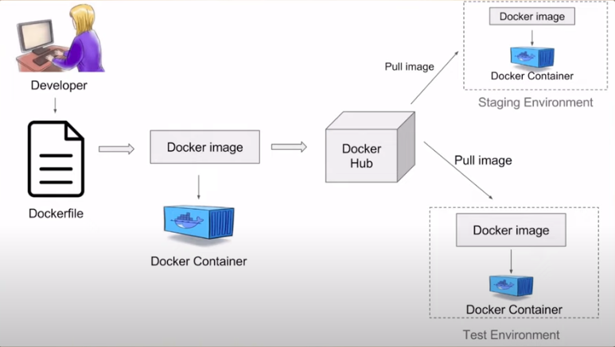

# Ngày 3: Docker

1. **Container**
    **Khái niệm**
    Là một môi trường thực thi phần mềm độc lập và cô lập, bao gồm mã nguồn và các thư viện + tài nguyên cần thiết để chạy ứng dụng. Nói chung, container đơn giản hoá việc triển khai ứng dụng bằng cách đóng gói ứng dụng và tất cả các phụ thuộc của nó vào một môi trường độc lập.
     
    Trong một môi trường container, ứng dụng chạy trong một môi trường cô lập với các container khác. Chúng có thể chia sẻ tài nguyên máy tính như CPU, RAM, ... với các ứng dụng trong container khác và với hệ thống máy chủ. Điều này giúp đảm bảo tính nhất quán và độ tin cậy của hệ thống
     
2. **Docker**
    1. **Khái niệm**
    Docker là một nền tảng ảo hoá giúp triển khai các container
     
    2. **Workflow**
     
    
     
    - Developer từ source code sẽ viết docker file để đóng gói dự án thành docker   image. Từ docker image, chúng ta sẽ đẩy lên registry. Trên các server chúng ta muốn chạy dự án, chỉ cần kéo docker image từ registry về.
    - Registry là một nơi để lưu trữ các docker image. Chúng ta có thể dựng riêng docker registry hoặc dùng docker hub (bị giới hạn về số docker image private muốn lưu trữ) để lưu trữ docker image.
     
    3. **Thực hành**
        - <code>docker run [OPTIONS ...] {docker_image} </code>: khởi tạo container từ một image có sẵn
            - <code> --name </code>: tuỳ chọn để đặt tên cho container
            - <code> -i </code>: tuỳ chọn cho phép nhập dữ liệu từ ngoài vào docker
            - <code> -t </code>: tuỳ chọn cho phép tạo một terminal cho docker
            - <code> -d </code>: tuỳ chọn để docker  run ở background
            - <code> -p host_port:docker_post </code>: tuỳ chọn để mở port 
        - <code>docker start [OPTIONS ...] {docker_container} {command} </code>: khởi động container được chỉ định. {docker_container} có thể là container id hoặc tên. 
        - <code>docker stop [OPTIONS ...] {docker_container} </code>: dừng container
        - <code>docker exec [OPTIONS ...] {docker_container} </code>: truy cập vào môi trường bên trong container.
            - <code> -i </code>: tuỳ chọn cho phép nhập liệu
            - <code> -t </code>: tuỳ chọn tạo một terminal trong container
            - {command}: một lệnh muốn docker thực hiện
            ví dụ: <code>docker exec -it ubuntu bash </code>
        - <code>docker rm {docker_container}</code>: xoá container. Sử dụng tuỳ chọn <code> -f </code> nếu container vẫn đang chạy, hoặc stop container nếu muốn xoá.
        - <code> docker rmi {docker_image}</code>: xoá image. tuỳ chọn <code> -f </code> để xoá image mà container của nó vẫn tồn tại, hoặc xoá container của image đó trước khi xoá nó.

        

