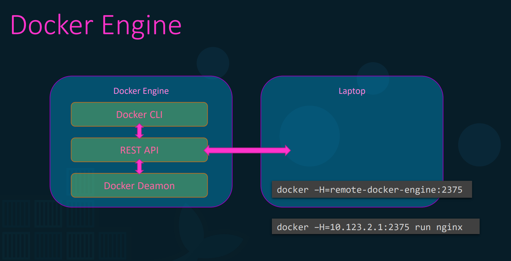
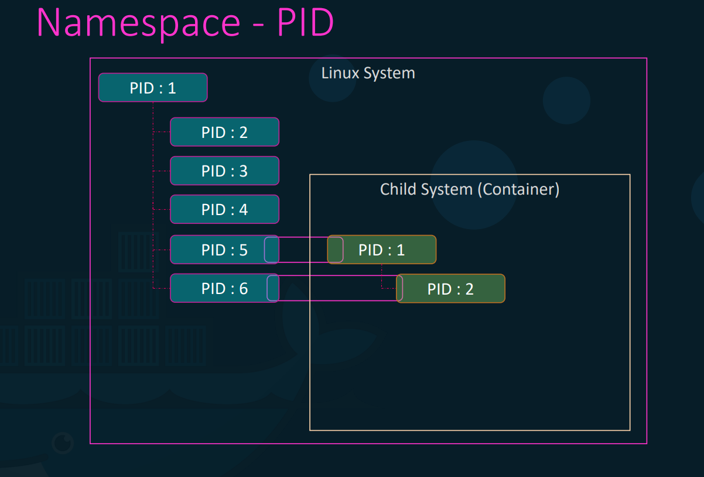
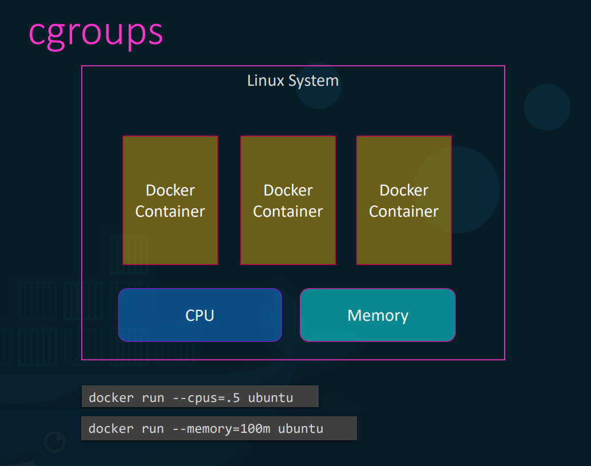
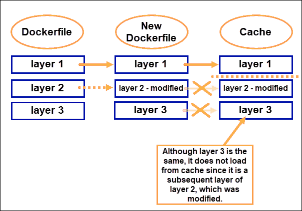
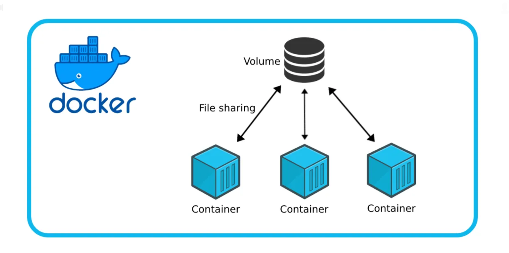
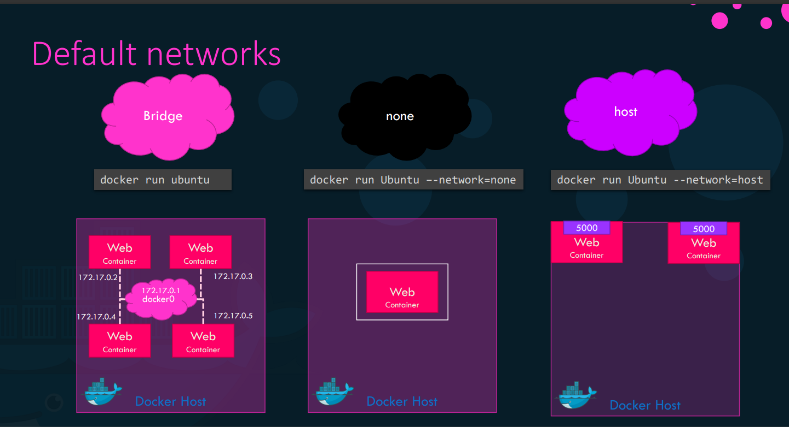

**Ngày 6: Docker Engine, Docker Storage, Docker Network**

1. **Docker Engine**
    
    - Là một thành phần cốt lõi của Docker, đây là ứng dụng client-server mà mỗi máy tính chạy Docker sẽ chạy một instance của Docker Engine. Docker Engine cung cấp môi trường để quản lý các container. 
        - **Docker Daemon**: là background process, chịu trách nhiệm quản lý các đối tượng trong Docker images, containers, volumes, networks.
        - **Docker REST API Server**: là API interface để Docker CLI có thể giao tiếp và đưa ra các chỉ thị cho Docker Daemon.
        - **Docker CLI**: là CLI để biểu diễn các hành động liên quan đến Docker như run, remove, .... CLI có thể remote từ máy khác
         
    - **Containerization**: Ứng dụng được đóng gói như thế nào?
        1. **namespace**: Docker sử dụng namespace để cô lập các tài nguyên của hệ thống giữa các container. Mỗi container sẽ chạy trong một namespace riêng, cho phép hoạt động như một môi trường độc lập, không liên quan đến các container khác hoặc máy chủ.
            - **PID (process id) namespace**
            
            - **Network namespace**
            - **InterProcess**
            - **Mount**
            - **Unix Timesharing**
             
        2. **cgroups**: quản lý và giới hạn tài nguyên phần cứng
            
            - cgroups cho phép Docker Engine quản lý và giới hạn tài nguyên của các Container
             
2. **Docker Storage**: Docker lưu trữ dữ liệu như thế nào và cách Docker quản lý hệ thống tập tin của các Container.
    - Khi cài đặt Docker, hệ thống file sẽ tự tạo thư mục <code>/var/lib/docker</code> để lưu trữ dữ liệu liên quan đến Docker.
    
    - **Docker Layerd Architecture**
    
     
    - **Docker Volumes** 
        - Các Layer trong khi dựng image sẽ ở chế độ Read Only.
        - Layer khi chạy container sẽ ở chế độ Read Write. Các dữ liệu thay đổi trên container sẽ tách riêng với image, các dữ liệu này sẽ mất khi exit container hoặc xoá container.
        - Vấn đề đặt ra khi chúng ta muốn lưu trữ các dữ liệu tạm thời này => **Docker Volume**
        - Sử dụng <code>docker run -v</code> (cách dùng cũ) hoặc <code>docker run --mount ...</code> (cách dùng hiện nay)
    
     
3. **Docker Network**  
    
    - Docker cài đặt mặc định 3 dải mạng: **Bridge, None, Host** 
    1. **Bridge Network**
        - Là private internal network được tạo bởi Docker trên host.
        - Mặc định các container khi chạy sẽ được đưa vào mạng này nếu không có chỉ thị gì đặc biệt
        - Giao tiếp với nhau thông qua internal ip được cấp
         
    2. **Host Network**
        - Là network mà container chia sẻ không gian mạng chung với host.
        - Các dịch vụ trong Container có thể sử dụng port mà máy chủ Docker (host) sử dụng.
        - Các container không thể sử dụng chung port với nhau hoặc với máy chủ Docker khác.
         
    3. **None Network**
        - Là network tách biệt riêng với tất cả các network khác, không thể kết nối ra mạng bên ngoài.
         
    4. **User-defined network**
        - Là network được tách riêng trong Bridge Network, được định nghĩa bởi user.
         

        
    
        
        
        
        
    
    

        
    