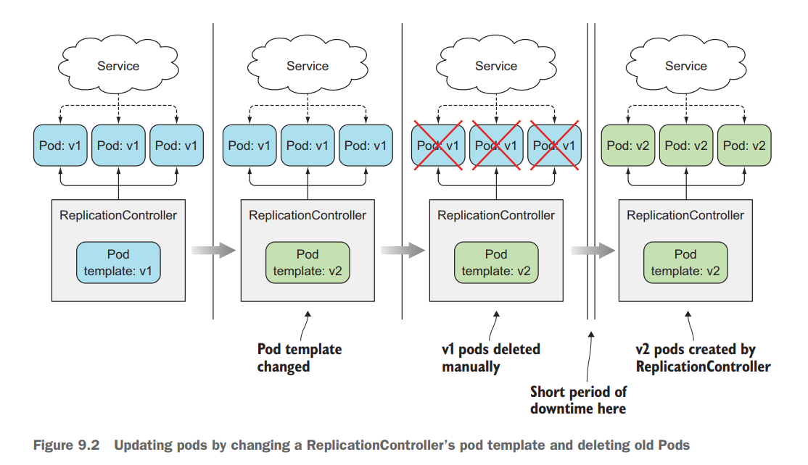
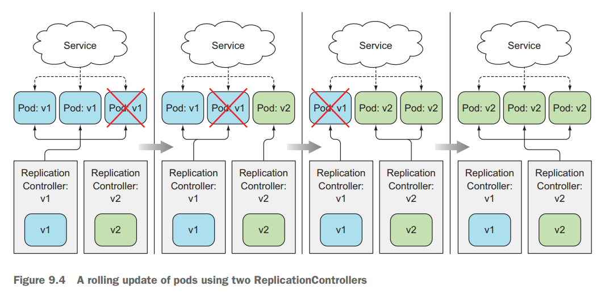
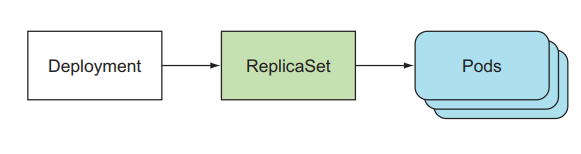
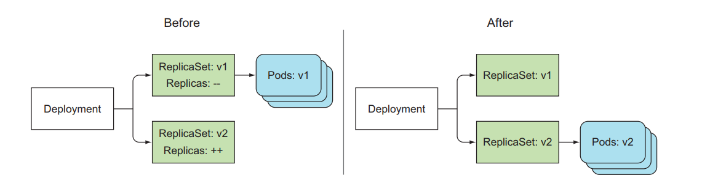
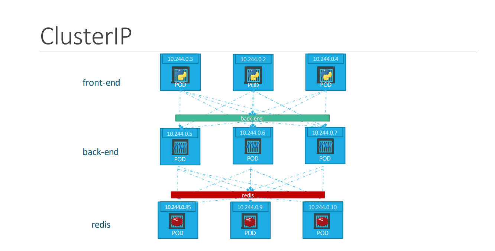

# Ngày 8: k8s (tiếp)

3. **k8s concepts** (tiếp)
    1. **Deployment**
        1. **Vấn đề: Cập nhật một ứng dụng đang chạy trong PODs, có 2 cách**
            - **Recreate**: 
                - Cách làm: xoá toàn bộ phiên bản cũ rồi cập nhật phiên bản mới. Trong k8s, chúng ta sẽ update Pod template của ReplicaSet, sau đó xoá các POD cũ để ReplicaSet tự động tạo ra các Pod với image mới
                - Ưu điểm: đơn giản, dễ thực hiện
                - Nhược điểm: ứng dụng downtime với client.
                
            - **RollingUpdate**:
                - Cách làm: deploy từng version mới của ứng dụng lên, chắc chắn nó chạy thành công, lặp lại quá trình cho đến khi toàn bộ version mới được deploy và version cũ bị xoá. Trong k8s, ta xoá lần lượt từng Pod để ReplicaSet tạo ra Pod mới.
                - Ưu điểm: ứng dụng không downtime với client
                - Nhược điểm: quá trình phức tạp
                
        2. **Giải pháp: Deployment**
            - Là một resource của k8s giúp giảI quyết vấn đề cập nhật version
            - Thực hiện tự động quá trình cập nhật version của ứng dụng với 2 chiến lược Recreate và Rollingback ở bên dưới. Dễ dàng rollback hoặc rollout
            
            - Cách Deployment update version:
            
        3. **Command thông dụng**:
            - <code>kubectl rollout history {resource type (deployment, pod, ...)} {resource name}</code>: xem lịch sử các lần cập nhật
            - <code>kubectl rollout undo {resource type (deployment, pod, ...)} {resource name}</code>: quay trở lại phiên bản ngay trước
            - <code>kubectl rollout status {resource type (deployment, pod, ...)} {resource name}</code>: kiểm tra trạng thái của một deployment
            - <code>kubectl set image {resource type (deployment, pod, ...)} {resource name} {container name}={image name}</code>
    2. **Kubernets Networking**
        - **Pod-to-Pod Networking**: mỗi Pod trong một node được gán một địa chỉ IP nằm trong dải mạng nội bộ của Pod đó (10.244.0.0)
        - **Cluster Networking**: Các node trong một cluster được gán địa chỉ IP. tuy nhiên dải mạng nội bộ của mỗi node lại giống nhau, chính vì thế có thể gây ra lỗi khi ta cố gắng giao tiếp Pod trong node này với Pod ở node khác. Vấn đề Routing được giải quyết bằng cách cài đặt một giải pháp có sẵn như vmWare, Cisco, ...
    3. **Kubernetes Services**
        - Giống như Deployment, k8s Services là một resource giúp tạo ra một constant point cho một nhóm Pod phía sau nó. Client sẽ mở connection tới service, và connection đó được dẫn đến một trong các Pod phía sau. Tương tự ReplicaSet, Service cũng sẽ dùng labels để chọn ra nhóm Pod nó sẽ quản lí connection.
        - Có 3 loại Service phổ biến:
            1. **Nodeport**: dùng để expose một ứng dụng bên trong clusterr ra ngoài bằng cách mở cổng trên mỗi node trong cluster
            

                    apiVersion: v1
                    kind: Service
                    metadata:
                    name: hello
                    spec:
                    selector:
                    app: hello-kube
                    type: NodePort
                    ports:
                    - port: 3000
                        targetPort: 3000
                        nodePort: 31000

            2. **ClusterIP**: ClusterIP sẽ tạo IP và local DNS để có thể truy cập bên trong cluster, không thể truy cập từ bên ngoài, dùng để cho các Pod trong cluster dễ dàng giao tiếp với nhau.
            
            
                    apiVersion: v1
                    kind: Service
                    metadata:
                    name: redis
                    spec:
                    selector:
                      app: redis # label selectors Pod redis
                    ports:
                      - port: 6379 # port of the serivce
                        targetPort: 6379 # port of the container that service will forward to

            3. **Load Balancer**