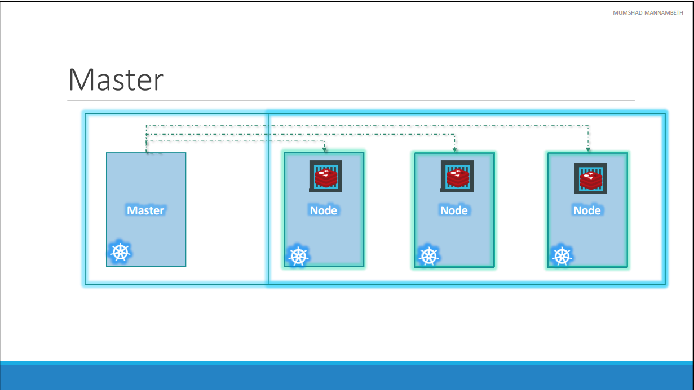
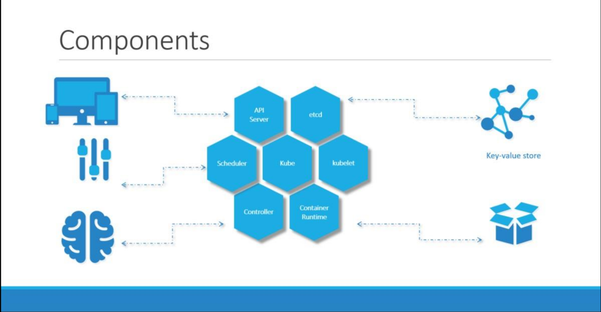

# Ngày 7: Kubernetes
1. **Container Orchestration**
    - **Container Orchestration** là quá trình tự động hoá việc triển khia, quản lý và mở rộng các container trên mạng lưới máy tính.
    - Một số tính năng:
        - Quản lý hàng trăm, hàng nghìn container.
        - Tự dộng hoá triển khai và cân bằng tải.
        - Quản lý vòng đời ứng dụng

2. **Kubernetes**
    - Là công cụ sử dụng công nghệ orchestration.
    - **Architecture**
        - **Node**: còn gọi worker machine là máy vật lý (hoặc ảo) mà Kubernetes được cài đặt trên đây. Các container sẽ khởi động bởi Kubernetes tại các node.
        - **CLuster**: tập hợp các node nhóm lại với nhau. Cluster sinh ra để giải quyết vấn đề nếu có một node bị crash, ứng dụng vẫn có thể chạy được 
        - **Master**: node Master chịu trách nhiệm cho sự phối hợp của các node trong cluster
        
    - **Components**: Khi cài đặt Kubernetes, thực ra chúng ta cài đặt các thành phần sau:
        - **API Server**: cung cấp API interface để user có thể tương tác, giao tiếp với k8s cluster.
        - **etcd service**: CSDL phân tán dạng key-value, được thiết kế để lưu trữ dữ liệu phân tán về cluster trên các node, đảm bảo tính sẵn sàng và tin cậy của dữ liệu
        - **Scheduler**: Bộ lập lịch chịu trách nhiệm phân chia các work và containers vào các node
        - **kubelet service**: mỗi node có một kubelet agent. agent này đảm bảo các container chạy trên các node như đã định trước
        - **Container Runtime**: là phần mềm chạy ngầm (thường là Docker) có nhiệm vụ chạy các container 
        - **Controller**: là bộ não của orchestration, chịu trách nhiệm thông báo, phản hồi khi các node, container sập. khi đó controller sẽ ra quyết định tạo thêm container mới hay không.  

        

3. **K8s Concepts**
    1. **PODS**
        - POD đại diện cho một nhóm các container, thường là 1. Container được đóng gói trong POD và POD là đơn vị nhỏ nhất trong k8s. 
        - Khi chúng ta muốn scale ứng dụng, k8s sẽ tạo thêm POD.
        - Trong trường hợp container chứa ứng dụng có một vài container đi kèm theo dạng hỗ trợ (helper container), ta có thể đóng gói >= 2 container trong cùng 1 POD để chúng có thể chia sẻ chung tài nguyên
        - Chạy 1 pod: <code>kuctl run {POD_name}</code>
        - **POD YAML file**:
            - Được sử dụng để định nghĩa POD
            - Cấu trúc

                    apiVersion: v1
                    kind: Pod
                    metadata:
                      name: myapp-pod
                      labels:
                          app: myapp
                          type: front-end
                    spec:
                      containes:
                        - name: nginx-container
                          image: nginx   
                            
            - Deploy POD: <code>kubectl  create -f {file_name.yaml}</code> hoặc <code>kubectl apply -f {file_name}.yaml</code> (phổ biến hơn)
    2. **Replication Controller**
        - Là hệ thống quản lí PODs trong k8s. Nó đảm bảo một số lượng nhất định PODs đang chạy tại bất kỳ thời điểm nào
        - Lí do sử dụng Replication Controller:
            - **High Availability**: Trong trường hợp có một số PODs bị crash, replication controller sẽ đảm bảo ứng dụng vẫn hoạt động bình thường thông qua việc khởi động các PODs mới.
            - **Load Balancing & Scaling**: Replication Controller cho phép chia sẻ công việc giữa các PODs (cân bằng tải). Thêm vào đó, nó có thể mở rộng các PODs thông qua các node khác, phục vụ cho việc scaling.
        - Tại thời điểm hiện tại, khái niệm replication controller được thay thế bằng replica set với một vài cải tiến
    3. **Replica Set**
        - Tương tự Replication Controller
        - Khác biệt:
            - **apiVersion**: <code>apps/v1</code> trong Replicaset so với <code>v1</code> trong Replication Controller
            - **Tính năng selector trong ReplicaSet**: Selector cho phép ReplicaSet có thể quản lí các PODs được định nghĩa từ trước đó bằng labels.
    4. **Scale**: khi chúng ta muốn scale ứng dụng (tăng số lượng PODs):
        - Thay đổi giá trị của trường <code>replicas</code> trong file định nghĩa
        - sử dụng <code>kubectl scale --replicas={values} -f {replicas-defination}.yaml </code>
    
### Tham khảo: [Kubectl Cheat sheet](https://kubernetes.io/vi/docs/reference/kubectl/cheatsheet/#x%C3%B3a-t%C3%A0i-nguy%C3%AAn)
        