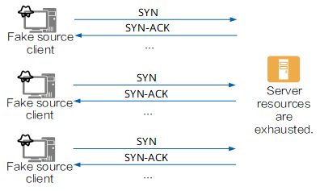

### DDoS - Distributed Denial of Service
1. **Khái niệm**
    - DDoS là các cuộc tấn được thiết kế với mục tiêu là quá tải các hệ thống
    - DDoS gây ảnh hưởng đến các kết nối hợp pháp (legitimate connections)
    - DDoS phức tạp hơn DoS ở chỗ phân tán (distributed), tức các kết nối bất hợp pháp sẽ đến từ rất nhiều IP khác nhau và hệ thống không thể ngăn chặn hết được.
2. **Các loại DDoS**
    - HTTP Flood - DDoS Layer7: Gửi một loạt truy vấn HTTP hợp lệ với mục tiêu làm quá tải hệ thống 

        

    - SYN Flood - DDoS Layer 4:
        - TCP Handshake: là quy trình quan trọng đảm bảo kết nối mạng an toàn và tin cậy sử dụng giao thức TCP, đảm bảo 2 thiết bị đều sẵn sàng để truyền tải thông tin
            - Bước 1 - Gửi gói tin SYN: A khởi tạo kết nối bằng cách gửi một gói tin SYN đến B. Gói tin SYN bao gồm:
                - Cờ SYN - đánh dấu đây là gói tin SYN
                - Số thứ tự ban đầu (ISN): một giá trị ngẫu nhiên được chọn bởi A để khởi tạo việc theo dõi số thứ tự cho luồng dữ liệu của A
                - Source port: port mà A dùng để truyền dữ liệu
                - Dest port: port mà B dùng để nhận dữ liệu
            - Bước 2 - Gửi gói tin SYN - ACK: khi nhận được gói tin SYN từ A, B sẽ gửi lại gói tin SYN - ACK để xác nhận đã nhận được gói tin SYN từ A và sẵn sàng kết nối. Gói tin SYN - ACK bao gồm:
                - Cờ SYN - đánh dấu đây là gói tin SYN
                - Cờ ACK - xác nhận ISN của A
                - ISN - một giá trị ngẫu nhiên được chọn bởi B để khởi tạo việc theo dõi số thứ tự cho luồng dữ liệu của B
                - Sorce port: port B dùng để truyền dữ liệu
                - Dest port: port A dùng để nhận dữ liệu
            - Bước 3 - Gửi gói tin ACK: khi nhận được gói tin SYN - ACK, A sẽ gửi một gói tin ACK để xác nhận nó đã nhận được SYN - ACK từ B. Gói tin ACK bao gồm:
                - Cờ ACK: Xác nhận ISN của B được gửi từ SYN - ACK
                - Source port: port A dùng để truyền dữ liệu
                - Dest port: port B dùng để nhận dữ liệu
            - Sau khi 3 bước trên hoàn thành, kết nối TCP được thiết lập và 2 bên có thể truyền tải thông tin cho nhau

            

        - SYN Flood: Sử dụng một mạng lưới máy tính botnet để gửi gói tin SYN đến Server. Sau đó Server phản hồi lại bằng gói tin SYN - ACK nhưng không bao giờ nhận được gói tin ACK. Điều này làm Server đặt trong trạng thái chờ liên tục và tiêu tốn tài nguyên mạng

            

