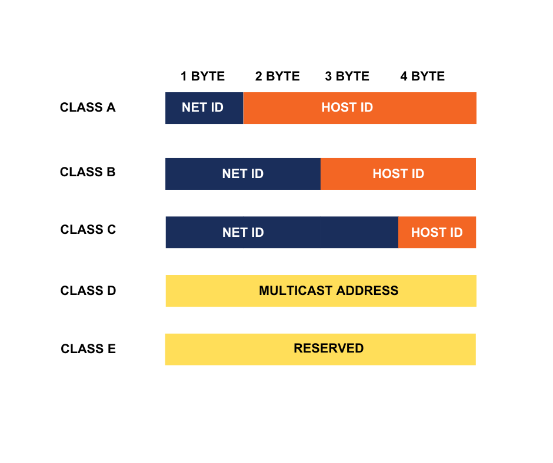

### IP Addressing and Subnetting

1. **IP Addressing**
    - IP là dãy 32 bit được sử dụng làm địa chỉ để giao tiếp trên internet
    - địa chỉ IP được chia làm 2 phần: network và host
    - Có 5 lớp địa chỉ IP, được phân loại theo quy mô của mạng
        - lớp A: <code>0.xxx</code> đến <code>127.255.255.255</code>
            - phần mạng: 0, 1, 2, ...127
            - phần host: xxx
            - 127 networks và 16,777,216 IPs mỗi network
            - Mạng quốc gia hoặc các ISP lớn
        - lớp B: <code>128.0.xx</code> đến <code>191.255.255.255</code>
            - phần mạng: 128.0, 128.1, ...191.254, 191.255
            - phần host: xx
            - 16,384 networks và 65,536 IPs mỗi network
            - Mạng doanh nghiệp
        - lớp C: <code>192.0.0.x</code> đến <code>223.255.255.255</code>
            - phần mạng: 192.0.0, 192.0.1, ...223.255.254, 223.255.255
            - phần host: x
            - 2.097.152 networks và 255 IPs mỗi network
            - Mạng gia đình hoặc văn phòng nhỏ
        - lớp D: <code>224.0.0.0</code> đến <code>239.255.255.255</code> 
            - địa chỉ multicast sử dụng cho truyền dữ liệu nhóm
        - lớp E: <code>240.0.0.0</code> đến <code>255.255.255.255</code>
            - địa chỉ sử dụng cho mục đích nghiên cứu

        

2. **Subnetting**
    - **CIDR**: Thay vì sử dụng các lớp mạng cốc dịnh, CIDR là cách sử dụng tiền tố mạng (network prefix) để xác định kích thước mạng và số lượng IP trên mỗi mạng.
    - Sử dụng CIDR giúp linh hoạt trong việc tận dụng địa chỉ IP bằng cách subnetting.
    - Subnetting là phương pháp chia các mạng thành các mạng con để tiết kiệm địa chỉ IP, tránh bị lãng phí
    - Có 2 loại Subnetting: **Fixed-length Subnet Mask (FLSM)** và **Variable-length Subnet Mask (VLSM)**
        1. FLSM
            - FLSM là cách chia mạng thành các mạng con (subnets) có prefix giống nhau
            - Nếu yêu cầu subnetting theo số lượng host mỗi network, ta sẽ xác định số bit của phần host sao cho số lượng host là nhỏ nhất mà >= số host yêu cầu. Tham khảo: [FLSM - part 1](https://www.youtube.com/watch?v=bQ8sdpGQu8c)
            - Nếu yêu cầu subnetting theo số lượng subnet, ta sẽ xác định số bit được mượn từ phần host sao cho số lượng subnet là nhỏ nhất mà >= số subnet yêu cầu. Tham khảo: [FLSM - part 2](https://www.youtube.com/watch?v=IGhd-0di0Qo&t=18s)
        2. VLSM
            - VLSM là cách chia mạng thành các mạng con có prefix khác nhau => số host khác nhau => tiện lợi hơn FLSM
            - Quy tắc: Subnetting cho subnet có số host lớn nhất -> nhỏ nhất
            - Tham khảo: [VLSM](https://www.youtube.com/watch?v=z-JqCedc9EI&t=654s)