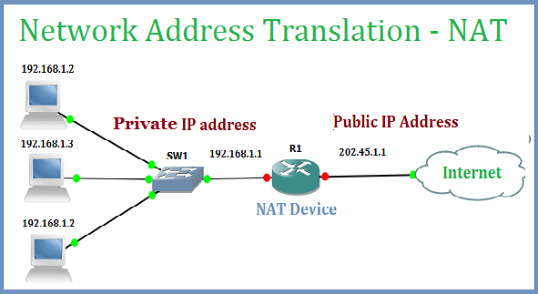

### Network Address Translation

1. **Khái niệm**
    - Network Address Translation được thiết kế để giải quyết vấn đề về số lượng có hạn của địa chỉ IPv4
    - NAT chuyển đổi Private IPv4 Address sang Public Ipv4 Address để có thể routing trên internet.
2. **Phân loại**
    - **Static NAT:** 1 private -> 1 (fixed) public. Sử dụng cho các use case liên quan đến việc cấp phát ip cố định cho server như dns server, web server, ... (cần các địa chỉ ip nhất quán)
    - **Dynamic NAT:** 1 private -> 1st public available, tương tự như Static NAT nhưng public ip là không cố định 
    - **Port Address Translation (PAT):** many private -> 1 public via port. ví dụ như home network, small office network, ...

    

3. **Cách hoạt động**
    - NAT device có nhiệm vụ gán private IP thành public IP.
    - Thông tin này được lưu trữ vào NAT table, tất cả các gói tin được gửi từ nguồn đến đích đi qua NAT sẽ dùng NAT table để tìm đuọc chính xác địa chỉ.