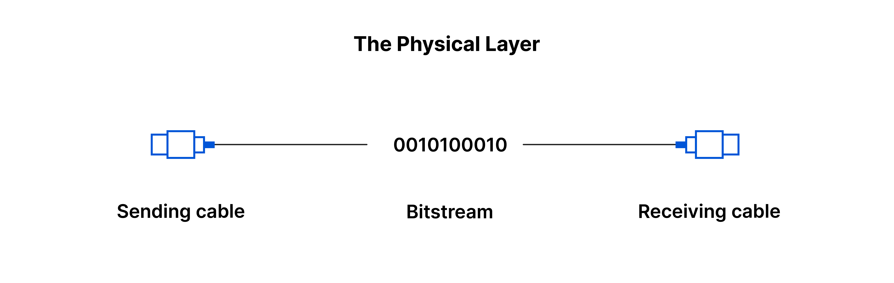

### OSI_model
1. **Layer 1: Physical Layer**
    - Layer 1 chịu trách nhiệm truyền tải dữ liệu dưới dạng bit thông qua môi trường vật lý
    - **Chức năng:** 
        - Mã hoá dữ liệu: chuyển từ bit sang tín hiệu vật lý (điện áp, xung ánh sáng, ...) phù hợp với môi trường truyền dẫn
        - Truyền tải tín hiệu: gửi tín hiệu vật lý thông qua môi trường truyền dẫn (dây cáp đồng, cáp quang, sóng vô tuyến - Wifi)
        - Giải mã tín hiệu: giải mã tín hiệu nhận được từ môi trường vật lý sang dữ liệu dạng bit
    - **Lưu ý:** Layer 1 chỉ có nhiệm vụ truyền dẫn dữ liệu thông qua môi trường vật lý, không có hiểu biết về khái niệm địa chỉ (address) => không có khái niệm **communications**

    

2. **Layer 2: Data Link Layer**
    - Layer 2 được xây dựng nằm trên Layer 1, chịu trách nhiệm truyền tải dữ liệu giữa các nodes (node-to-node), ví dụ: pc-switch, switch-router, router-router 
    - **Frame:** Frame là một định dạng dữ liệu được truyền tải ở Layer 2
    - **MAC**: mỗi thiết bị ở Layer 2 có một hardware address riêng biệt gọi là MAC address. MAC address đảm bảo dữ liệu truyền chính xác trên mạng

3. **Layer 3: Network Layer**
    - Layer 3 được xây dựng nằm trên Layer 1 và 2, chịu trách nhiệm truyền tải dữ liệu giữa các host nằm trên các mạng khác nhau
    - Cung cấp địa chỉ logic (IP Address)
    - Định tuyến đương đi giữa nguồn và đích 
